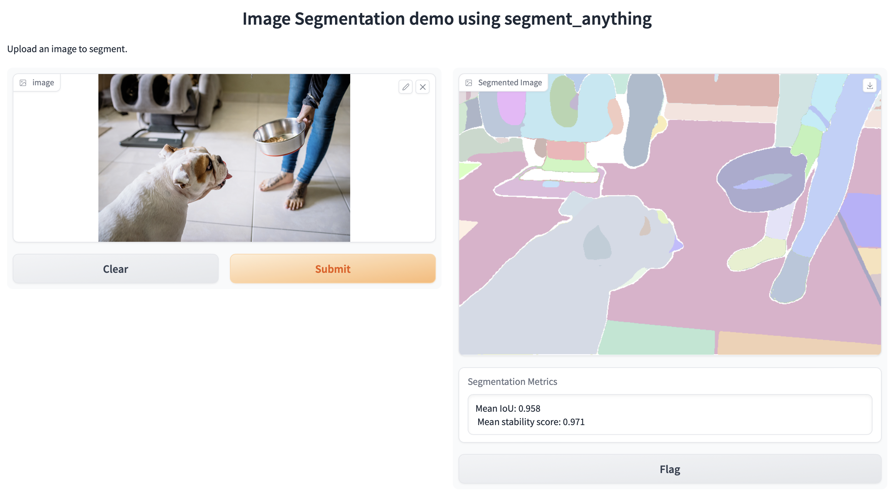

# Segment Anything with Gradio UI

[](https://github.com/gradio-app/gradio/actions/workflows/ui.yml)

## Introduction

This repository contains code and resources for segmenting anything using Gradio UI. Gradio is a Python library that allows you to quickly create customizable UI components for your machine learning models, making it easy to interact with and visualize the results of your segmentation model.

The goal of this project is to provide a user-friendly interface for segmenting objects or regions of interest in images or videos. By leveraging the power of Gradio UI, users can intuitively draw bounding boxes, polygons, or masks on the input media, and obtain the corresponding segmentations using the underlying segmentation model.

**Note: This repository is a work in progress.**

## Features

- Easy-to-use Gradio UI interface for segmenting images/videos
- Support for drawing bounding boxes, polygons, or masks
- Integration with underlying segmentation model for generating accurate segmentations

## Installation

To get started with the project, follow these steps:

1. Clone the repository:

   ```shell
   git clone https://github.com/Rakesh-Raushan/segment-anything-gradio-demo.git
   cd segment-anything-gradio-demo
2. Create a virtual environment (optional but recommended)::

   ```shell
    python3 -m venv venv
    source venv/bin/activate  # for Linux/macOS
3. Install the dependencies::

   ```shell
    pip install -r requirements.txt
## Usage

To use the Gradio UI for segmenting anything, follow these steps:

1. [Run the application...]

    ```shell
    python app.py
    ```

    The Gradio UI will start running and display the local URL where you can access it (e.g., http://localhost:7860).
    Since the model download happens the first time, it will take 3-4 mins to start.

2. Interact with the Gradio UI to segment images or videos:

    - Select an image file by clicking on the "Upload".
    - Click the "Submit" button to generate the corresponding segmentations.
    - The segmented results will be displayed alongside the original media.
    - On CPU, complete segmentation is currently slow and takes around 50sec to execute.

    

## Acknowledgments

- [Gradio](https://www.gradio.app/) - The Python library for creating UI components
- [Segment-anything](https://github.com/facebookresearch/segment-anything) - Facebook research project by Meta to build a starting point for foundation models for image segmentation

## Contact

For any inquiries or questions, please contact [Rakesh-Raushan](mailto:mod.rakesh24@gmail.com).


